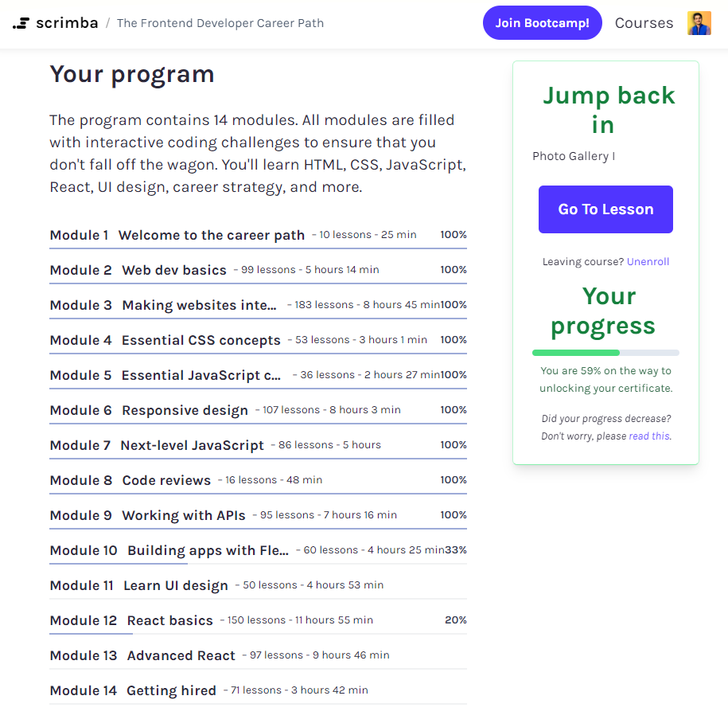

# 👋 Hi there, I'm Waqas Khan 
Nick Name: Wagas kon
## Jounery
I was studing civil engineering 🏭👨‍🔧🛠 at [GIKI](https://giki.edu.pk/) but programming attract my interest when I learn C++ in one of our courses. so I start exploring more and ended up at [Scrimba](scrimba.com). 🔀

## Interests:
👀 I’m interested in coding :computer:, learning new languages, technologies and specially WEB 3.0.

## Learning :🧑🏻‍💻
🌱 I’m currently learning deep dive 
- TypeScript and React via [Scrimba Frontend Career Path](https://scrimba.com/learn/frontend).  
<!-- - Solidity, NFT Smart Contract, Dapp, Web 3.0 and MetaVerse from [@MoralisWeb3](https://docs.moralis.io/introduction/readme) and [@alchemyplatform](https://docs.alchemy.com/alchemy/road-to-web3/welcome-to-the-road-to-web3). -->

## Skills:🎯💪🤸

<!-- - HTML5
- CSS3
- Figma 
- JavaScript + ES6
- TypeScript
- React Js -->

## Relavent Knowledge:📚🧠💡: 
- APIs
- Web architecture
- Responsive design
- Web design
- UI Design
- Git and npm
- Coding Reviews

## Projects Respository : 
### HTML/CSS/JavaScript Solo Projects
<!-- 

    
Scrimba Javascript Solo Projects:
 -->
  <!-- ### Scrimba Solo Projects: -->
  
 Scrimba provides solo projects throughout the career path which is performed on your own without the instructer guidence

  <nav class="list" >
  <li>Crypto and Weather App | <a href='https://wagaskon.github.io/Crypto-and-Weather-App-as-Extension/'  target=”_blank”>  Deployed Site link </a> | <a href='https://github.com/wagaskon/Crypto-and-Weather-App-as-Extension' target=”_blank”> Repository files</a></li> 

  <nav class="list" >
  <li>Units Converter Extension |<a href='https://wagaskon.github.io/Unit-Converter-Extension/'  target=”_blank”>  Deployed Site link </a> | <a href='https://github.com/wagaskon/Unit-Converter-Externsion' target=”_blank”>Repository files</a></li> 

  <li>Bookmarking Browser Extension |<a href='https://wagaskon.github.io/Bookmarking-BrowserExtension/'  target=”_blank”>  Deployed Site link </a> | <a href='https://github.com/wagaskon/Browser-Extension' target=”_blank”>Repository files</a></li> 

  <li>Random Password Generator |<a href='https://wagaskon.github.io/Random-Password-Generator/'  target=”_blank”>  Deployed Site link </a> | <a href='https://github.com/wagaskon/Random-Password-Generator' target=”_blank”>Repository files</a></li> 

  <li>Basket Ball Game |<a href='https://wagaskon.github.io/Basket-Ball-Game/'  target=”_blank”>  Deployed Site link </a> |<a  href='https://github.com/wagaskon/Basket-Ball-Game' target=”_blank”>Repository files</a></li> 

  <li>Visit Pakistan Sample Site |<a href='https://wagaskon.github.io/Visit-Pakistan/'  target=”_blank”>  Deployed Site link </a> |<a  href='https://github.com/wagaskon/Visit-Pakistan' target=”_blank”>Repository files</a> 
  
 </nav>        
<!-- 
 -->

<!-- 

    
Scrimba React Solo Projects:
 -->
  <!-- ### Scrimba React Solo Projects: -->
  ### React Projects:
  <!-- 
 Scrimba provides solo projects throughout the career path which is performed on your own without the instructer guidence
 -->
  <nav class="list" >
  <li>Business Card using react js | 
  <a href='https://businesscard-react101.netlify.app/' >  Deployed Site link </a> | 
  <a href='https://github.com/wagaskon/BusinessCard'> Repository files</a></li> 

  <li>Tenzies Dice Game | 
  <a href='https://tenziegame101.netlify.app/' >  Deployed Site link </a> | 
  <a href='https://github.com/wagaskon/Tenzies-Games'> Repository files</a></li> 
  </nav>        

## Blogs : 

<!-- 

    
HTML Blogs at DEV
 -->
<!-- 
DEV.to is a community of software developers getting together to help one another out. The software industry relies on collaboration and networked learning.
 -->
 ### HTML Blogs:        
<nav>
<li><a  href='https://dev.to/waqaskhan/html-tags-abbrmapareaaside-oa5'>HTML tags: Most beginner does not Know( Part 1)</a></li> 
<li><a  href='https://dev.to/waqaskhan/html-audio-explained-3jbd'>HTML tags: Most beginner does not Know ( Part 2)</a></li> 
<li><a  href='https://dev.to/waqaskhan/html-tags-most-beginner-does-not-know-part-3-44ae'>HTML tags: Most beginner does not Know( Part 3)</a></li> 
 

## Frontend Career Path Progress At Scrimba University: 
<!--  -->

<!-- </nav>        

 -->

<!-- ## Cerificates and Awards

## Portfolio Link -->
